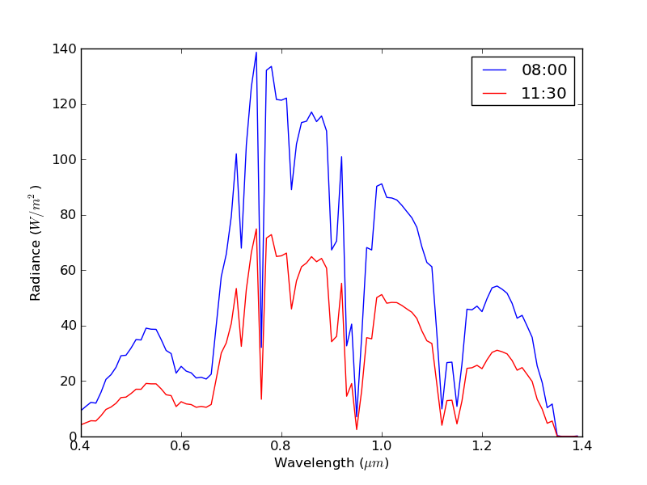
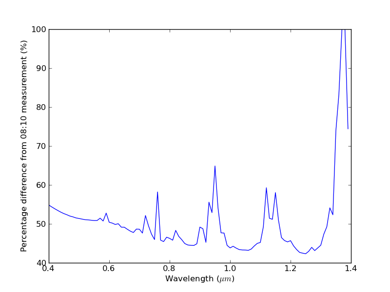

Case Study: Assessing the effect of atmospheric changes during the NCAVEO Field Campaign
----------------------------------------------------------------------------------------

This page describes an example use of some of the more advanced features of Py6S which should allow you to get a sense of how Py6S can be used as part of real-world scientific research.

Background
==========
The NCAVEO Field Campaign took place in June 2006 and involved the collection of a large number of ground, airborne and spaceborne measurements of the area around Chilbolton, Hampshire, UK with the aim to produce a large dataset of many observations which could be used for model testing and validation (REF HERE). On the main day of data collection (17th June) the atmospheric conditions worsened as the day progressed, thus leading to issues in comparing the data taken at different periods during the day. This issue was a particular problem when attempting to mosaic a number of flightlines obtained from airborne data over a period of around 2 hours. The aim of this example is to show how simulations can easily be performed with Py6S to assess the significance of these atmospheric changes, and the possible influence on uses of this data.

The AERONET site at Chilbolton provides automatic regular sun photometry measurements, with AOT data available approximately every 15 minutes. However, only cloud-screened (level 1.5) data is processed through an inversion algorithm to retrieve more detailed data on the aerosol properties. During the morning of the 17th June, full inverted data is only available at 08:02 and 11:08. However, as these two times are likely to be close to the two extremes of atmospheric conditions, analysis at only these times will still provide a useful test of the significance of the changes.

Code
====

Py6S code has been written to import this AERONET data, set suitable other parameters, and run simulations for both times with the ground reflectance set to a standard green vegetation spectral reflectance profile. The resulting at sensor radiances and the percentage difference between them are shown below the code.

The code is included below and in the ``casestudy`` folder in the `Github repository <https://github.com/robintw/Py6S>`_. The code requires the ``CHL`` file to exist, this is also available in this folder::

	# Import Py6S1#
	from Py6S import *
	# Import the Matplotlib plotting environment
	from matplotlib.pyplot import *
	# Import the functions for copying objects
	import copy

	# Define a function to easily calculate NDVI
	def ndvi(red, nir):
	  return ((nir - red) / (nir + red))

	# Create a SixS object for the 'early' time (~08:00)
	early = SixS()
	# Set the altitudes
	early.altitudes.set_target_sea_level()
	early.altitudes.set_sensor_satellite_level()
	# Set the ground reflectance to be a typical green veg spectrum
	early.ground_reflectance = GroundReflectance.HomogeneousLambertian(GroundReflectance.GreenVegetation)
	early.geometry = Geometry.User()

	# Make a copy of the SixS object to use for the 'late' time (~11:30)
	late = copy.deepcopy(early)

	# Import the AERONET data into each SixS object
	SixSHelpers.Aeronet.import_aeronet_data(early, "CHL", "17/06/2006 08:00:00")
	SixSHelpers.Aeronet.import_aeronet_data(late, "CHL", "17/06/2006 11:30:00")

	# Set the geometry for each SixS object
	# With solar angles from location and time and
	# with view from nadir
	early.geometry.from_time_and_location(51.14510, -1.43861, "17/06/2006 08:00:00", 0, 0)
	late.geometry.from_time_and_location(51.14510, -1.43861, "17/06/2006 11:30:00", 0, 0)

	# Run each simulation for the VNIR wavelengths - using a wider spacing than default
	# to make the simulation faster
	wv, early_res = SixSHelpers.Wavelengths.run_vnir(early, spacing=0.01, output_name='pixel_radiance')
	wv, late_res = SixSHelpers.Wavelengths.run_vnir(late, spacing=0.01, output_name='pixel_radiance')

	# Plot the two radiance curves
	clf()
	plot(wv, early_res, 'b-', label="08:00")
	plot(wv, late_res, 'r-', label="11:30")
	xlabel("Wavelength ($\mu m$)")
	ylabel("Radiance ($W/m^2$)")
	legend()
	savefig("ncaveo_radiances.png")

	# Calculate the percentage difference and plot it
	clf()
	perc_diff = ((early_res - late_res) / early_res) * 100
	plot(wv, perc_diff)
	xlabel("Wavelength ($\mu m$)")
	ylabel("Percentage difference from 08:10 measurement (%)")
	savefig("ncaveo_perc_diff.png")

	# Run simulations again for the SPOT HRV sensor
	# to then calculate the NDVI difference
	wv, early_spot = SixSHelpers.Wavelengths.run_spot_hrv(early, output_name='pixel_radiance')
	wv, late_spot = SixSHelpers.Wavelengths.run_spot_hrv(late, output_name='pixel_radiance')

	print early_spot
	print late_spot

	# Calculate NDVIs
	early_ndvi = ndvi(early_spot[1], early_spot[2])
	late_ndvi = ndvi(late_spot[1], late_spot[2])

	print "Early NDVI:\t%f" % early_ndvi
	print "Late NDVI:\t%f" % late_ndvi
	print "Percentage Difference:\t%f" % (((early_ndvi - late_ndvi) / early_ndvi) * 100)

Text output::

	Early NDVI:	0.660894
	Late NDVI:	0.678239
	Percentage Difference:	-2.624595

It seems that the change in radiance is high, with an average change of 50%, which suggests that there are likely to be issues with using raw radiance data collected over the course of the morning. However, when assessing the significance of this change it is often helpful to look at standard remote sensing outputs like NDVI, rather than radiance. NDVI calculations show a reduction of 2.62% between 08:00 and 11:30, suggesting that although the deteriorating atmospheric conditions did have a spectrally-varying effect, and thus changed the NDVI values, this change is unlikely to be significant.