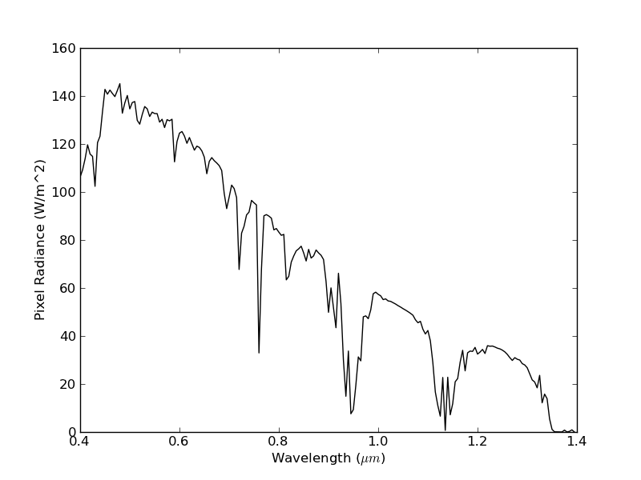
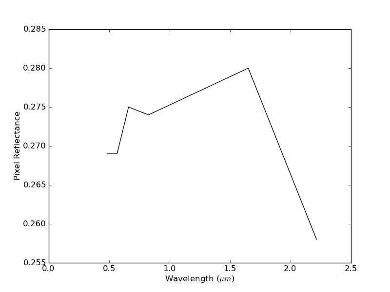

Helper methods
================================

The SixSHelpers module contains a number of helper functions that improve the ease-of-use of Py6S. These include functions to set 6S parameters from various external data sources, as well as functions to make it easy to produce wavelength and BRDF plots from 6S runs.

Running for many wavelengths
----------------------------
The Wavelengths class contains functions to run 6S over a number of wavelength ranges.

For example, the following code runs 6S simulations across the Visible-Near Infrared wavelength range and plots the results, producing the output shown below::

  from Py6S import *
  s = SixS()
  s.aero_profile = AeroProfile.PredefinedType(AeroProfile.Maritime)
  wavelengths, values = SixSHelpers.Wavelengths.run_vnir(s, output_name='pixel_radiance')
  SixSHelpers.Wavelengths.plot_wavelengths(wavelengths, values, 'Pixel Radiance (W/m^2)')

A similar function exist to run across the whole 6S wavelength range (:meth:`.run_whole_range`), and arbritary lists of wavelengths can be run using the :meth:`.run_wavelengths` function. For example, you can manually specify a number of wavelengths to run for::

  wv, res = SixSHelpers.Wavelengths.run_wavelengths(s, [0.46, 0.67, 0.98], output_name='apparent_radiance')

If you want to run user-specific ranges of wavelengths then you can use the handy numpy functions `arange <http://docs.scipy.org/doc/numpy/reference/generated/numpy.arange.html>`_ and `linspace <http://docs.scipy.org/doc/numpy/reference/generated/numpy.linspace.html>`_ to generate the lists of wavelengths for you. For example::

  # Run the model between 0.5 and 0.7um with a step of 0.001um (1nm)
  wv, res = SixSHelpers.Wavelengths.run_wavelengths(s, np.arange(0.5, 0.7, 0.001), output_name='apparent_radiance')

  # Run the model at 50 equally-spaced wavelengths in the range 0.9-1.5um
  wv, res = SixSHelpers.Wavelengths.run_wavelengths(s, np.linspace(0.9, 1.5, 50), output_name='apparent_radiance')

Functions also exist to run for all bands of the various sensors supported in 6S (for example, :meth:`.run_landsat_tm`, :meth:`.run_modis` and :meth:`.run_aatsr`). It should be noted that for these functions, bands which are outside of the 6S wavelength range (0.2-4.0um), such as the Landsat thermal band, will not be simulated. The example below shows the creation of a plot for the Landsat ETM bands::

  from Py6S import *
  s = SixS()
  s.aero_profile = AeroProfile.PredefinedType(AeroProfile.Maritime)
  wavelengths, values = SixSHelpers.Wavelengths.run_landsat_etm(s, output_name='pixel_reflectance')
  SixSHelpers.Wavelengths.plot_wavelengths(wavelengths, values, 'Pixel Reflectance')

The supported sensors are:

  * Landsat MSS, TM and ETM
  * SPOT HRV1, HRV2 and Vegetation
  * MERIS
  * MODIS
  * POLDER
  * SeaWiFS
  * AATSR
  * ASTER
  * VIIRS
  * ER2 MODIS Airborne Simulator (MAS)
  * ALI
  * GLI

.. autoclass:: Py6S.SixSHelpers.Wavelengths
  :members:

Running for many angles
-----------------------
The Angles class contains functions to run 6S over a number of different angles, which are particularly useful when dealing with surfaces with a modelled-BRDF.

For example, the following code runs 6S simulations for many view zenith and azimuth angles and plots a polar contour plot of the resulting reflectance distribution. The output is shown below::
  
    s = SixS()
    s.ground_reflectance = GroundReflectance.HomogeneousRoujean(0.037, 0.0, 0.133)
    s.geometry.solar_z = 30
    s.geometry.solar_a = 0
    SixSHelpers.Angles.run_and_plot_360(s, 'view', 'pixel_reflectance')

.. image:: roujean_plot.png
    :scale: 50
    
.. autoclass:: Py6S.SixSHelpers.Angles
  :members:

Importing atmospheric profiles from radiosonde data
---------------------------------------------------
6S is provided with a number of pre-defined atmospheric profiles, such as Midlatitude Summer, Tropical and Subarctic Winter. However, it also possible to parameterise 6S using data acquired from radiosonde (weather balloon) measurements.

The main function in this class (:meth:`.import_uow_radiosonde_data`) imports radiosonde data from the University of Wyoming's radiosonde data website to 6S, allowing accurate parameterisation based on real-world measurements.

.. autoclass:: Py6S.SixSHelpers.Radiosonde
  :members:
  
Importing aerosol data from AERONET data
----------------------------------------
6S also has a number of pre-defined aerosol profiles, such as Maritime and Urban, as well as a number of methods for setting aerosol particle distributions based on theoretical distributions. However, the AERONET network (http://aeronet.gsfc.nasa.gov/) stores and processes sun photometer data from many stations around the world which allow the more accurate parameterisation of aerosols in 6S.

The main function in this class (:meth:`.import_aeronet_data`) imports data from an AERONET CSV file and sets the ``aero_profile`` and ``aot550`` parameters of the 6S model accordingly.

.. autoclass:: Py6S.SixSHelpers.Aeronet
  :members:

Importing ground reflectance spectra from spectral libraries
------------------------------------------------------------

These functions allow you to import spectra from two widely-used spectral libraries: the `USGS Spectral Library <http://speclab.cr.usgs.gov/spectral.lib06/>`_ and the `ASTER Spectral Library <http://speclib.jpl.nasa.gov/>`_ and use the spectra to define the ground reflectance of a 6S model run.

.. autoclass:: Py6S.SixSHelpers.Spectra
  :members: