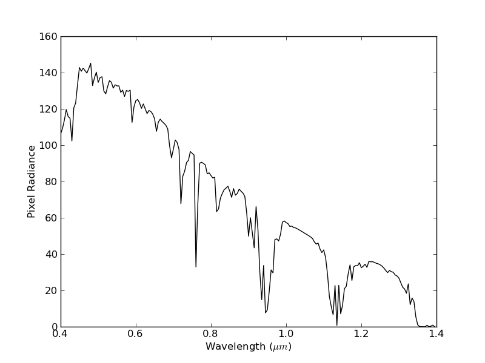
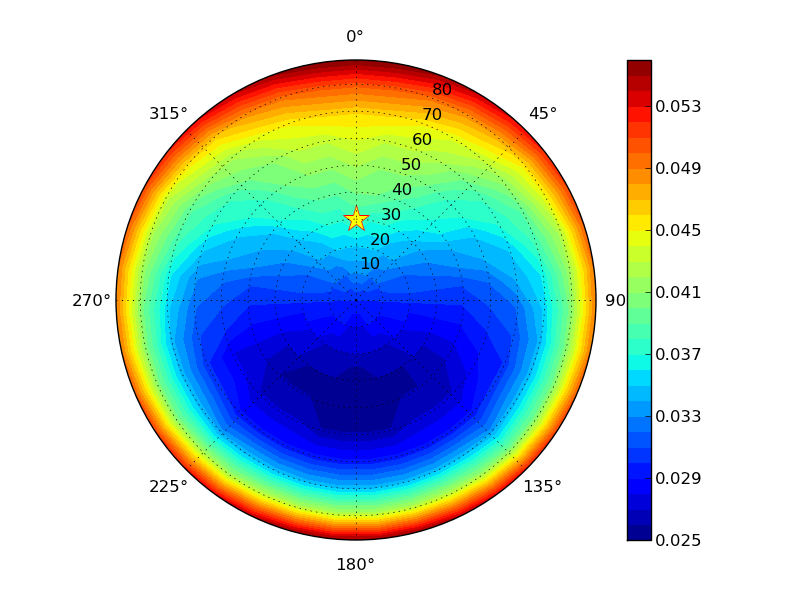

Quick Start
================================

Now that you've installed Py6S, this section will give you a brief guide on how to use it.

A note on IPython
-----------------
IPython is an interactive Python shell that has many more features than the standard Python shell. The most useful of these is tab-completion, which will provide significant help in learning how to use Py6S. If you type part of an identifier - for example, ``s.a`` and press *TAB* you will see all of the possible completions. This works for all parts of Py6S, including the output values. For example::

  In [3]: s.a<TAB>
  s.aero_profile   s.altitudes      s.aot550         s.atmos_corr s.atmos_profile
  
  In [4]: s.outputs.tra<TAB>
  s.outputs.transmittance_aerosol_scattering   s.outputs.transmittance_oxygen
  s.outputs.transmittance_ch4                  s.outputs.transmittance_ozone
  s.outputs.transmittance_co                   s.outputs.transmittance_rayleigh_scattering
  s.outputs.transmittance_co2                  s.outputs.transmittance_total_scattering
  s.outputs.transmittance_global_gas           s.outputs.transmittance_water
  s.outputs.transmittance_no2        

It is also very easy to get help on individual parts of Py6S from within IPython. Simply type any name, and append a ``?`` to it - for example ``AeroProfile.MultimodalLogNormal?``. The documentation which is shown will describe the parameters required and give an example of usage.

A first run
-----------

The :class:`.SixS` class is at the heart of Py6S. It has methods and attributes that allow you to set 6S parameters, run 6S and then view the outputs.

Py6S sets every 6S parameter to a sensible default, so the simplest possible code just uses the default values. As a nice introduction, we're going to
plot one of the 6S outputs across the whole Visible-NIR wavelength range::

  # Import all of the Py6S code  
  from Py6S import *
  # Create a SixS object called s (used as the standard name by convention)
  s = SixS()
  # Run the 6S simulation defined by this SixS object across the
  # whole VNIR range
  wavelengths, results = SixSHelpers.Wavelengths.run_vnir(s, output_name="pixel_radiance")
  # Plot these results, with the y axis label set to "Pixel Radiance"
  SixSHelpers.Wavelengths.plot_wavelengths(wavelengths, results, "Pixel Radiance")
  
This will produce a graph like the following:

You will see a number of buttons in the window that is showing the graph. These allow you to zoom in to specific areas of the plot, move the plot around, adjust the margins, and save the plot to a file.
  
This shows the utility of Py6S very nicely - imagine how long it would have taken to produce this plot by editing and running 6S input files manually! However, the plot probably isn't particularly helpful as the defaults I've chosen probably aren't the parameters that you want to use for your simulation, and you may not be interested in the calculated pixel radiance. The sections below will explain how to alter this simple program to produce more useful results.

Setting parameters
------------------

We'll start with an example, and then explain the details::

  from Py6S import *
  s = SixS()
  s.atmos_profile = AtmosProfile.PredefinedType(AtmosProfile.Tropical)
  s.wavelength = Wavelength(0.357)
  s.run()
  print s.outputs.pixel_radiance

You can see here that we have changed the atmospheric profile to a pre-defined profile called 'Tropical', and changed the wavelength that we are using for the simulation to 0.357 micrometres. You can also see that here we're accessing the outputs directly, rather than running it over a specific wavelength range and plotting it. Try finding out what other outputs you can access, by typing ``s.outputs.`` and pressing *TAB*.

We'll look in detail at extracting outputs later, but first, lets have a look at the parameters that we can change, summarised in the table below:

====================== ============================================================== =========================================================
SixS Parameter           Description                                                    Possible values
====================== ============================================================== =========================================================
``atmos_profile``      Atmospheric profile (pressure, water vapour, ozone etc)        Any outputs from :class:`.AtmosProfile`
``aero_profile``       Aerosol profile (types, distributions etc)                     Any outputs from :class:`.AeroProfile`
``ground_reflectance`` Ground reflectance (Homogeneity, BRDF etc.)                    Any outputs from :class:`.GroundReflectance`
``geometry``           Viewing/Illumination geometry (manual or satellite-specific)   A ``Geometry*`` class, for example :class:`.Geometry.User`
``aot550``             Aerosol Optical Thickness at 550nm                             Floating point number
``visibility``         Visibility in km                                               Floating point number
``altitude``           Altitudes of the sensor and target                             An instance of the ``Altitudes`` class
``atmos_corr``         Atmospheric correction settings (yes/no, reflectances)         Any outputs from :class:`.AtmosCorr`
====================== ============================================================== =========================================================

As you can see, the parameter and class names are designed to be fairly self-explanatory. Using the details from above, a more advanced parameterisation is shown below::

  from Py6S import *
  s = SixS()
  s.atmos_profile = AtmosProfile.UserWaterAndOzone(3.6, 0.9) # Set the atmosphere profile to be based on 3.6cm of water and 0.9cm-atm of ozone
  s.wavelength = Wavelength(Wavelength.LANDSAT_TM_B3) # Set the wavelength to be that of the Landsat TM Band 3 - includes response function 
  s.ground_reflectance = GroundReflectance.HomogeneousWalthall(1.08, 0.48, 4.96, 0.5) # Set the surface to have a BRDF approximated by the Walthall model
  s.geometry = Geometry.Landsat_TM()
  s.geometry.month = 7
  s.geometry.day = 14
  s.geometry.gmt_decimal_hour = 7.75
  s.geometry.latitude = 51.148
  s.geometry.longitude = 0.307
  s.run()
  print s.outputs.pixel_radiance
  
This is far more detailed, but should be self-explanatory given the comments and the table above. Far more details about the individual parameterisations are available in their documentation pages.

The real power of Py6S comes when you combine the paramterisation abilities of Py6S with the standard Python programming constructs. This is basically what we did above for the ``run_vnir`` example, although there we used a :class:`.SixSHelpers` method to make it easier for us. We can also do this manually, for example, you can easily loop over a number of parameter values and produce the outputs for each of them::

  from Py6S import *
  s = SixS()
  
  for param in [AtmosProfile.Tropical, AtmosProfile.MidlatitudeSummer, AtmosProfile.MidlatitudeWinter]:
    s.atmos_profile = AtmosProfile.PredefinedType(param)
    s.run()
    print s.outputs.pixel_radiance
    
You can see that in this instance the change in pixel radiance over different atmospheric profiles is fairly low (< 0.8). Again, this saves a lot of time and complex input file editing.

That's it for the quick guide to setting parameters - for more details see the rest of the documentation.

Accessing outputs
-----------------
The outputs from the 6S model are available under the ``s.outputs`` attribute. The outputs are actually stored as dictionaries, and the main set of outputs can be printed (and saved) from the ``s.outputs.values`` attribute. For example::

  from Py6S import *
  s = SixS()
  s.run()
  print s.outputs.values
  
However, it's normally more useful to access individual outputs. This can be done using the standard Python dictionary access methods - for example, ``print s.outputs.values['pixel_radiance']``, but it is generally easy to do this by appending the output name to ``s.outputs.``. For example::

  from Py6S import *
  s = SixS()
  s.run()
  print s.outputs.pixel_radiance
  print s.outputs.environmental_irradiance
  print s.outputs.total_gaseous_transmittance

The outputs stored under ``s.outputs.values`` are the main outputs of 6S provided on the first two 'screenfulls' of raw 6S output. The names of the outputs in Py6S have been kept as similar to the labels in the raw 6S output as possible, although sometimes names have been changed to improve clarity. Remember that a list of all possible outputs can be gained by typing ``s.outputs.`` and pressing *TAB* in IPython.

The tables showing the integrated values of various transmittances (rayleigh, water, ozone etc) are stored under the ``s.outputs.trans`` dictionary as instances of the :class:`Transmittance` class. This allows the easy storage of the three different transmittances: downward, upward and total. Again, rather than dealing with the dictionary directly, courtesy methods are provided, for example::

  from Py6S import *
  s = SixS()
  s.run()
  print s.outputs.transmittance_rayleigh_scattering
  print s.outputs.transmittance_rayleigh_scattering.downward
  print s.outputs.transmittance_rayleigh_scattering.upward
  print s.outputs.transmittance_rayleigh_scattering.total
  print s.outputs.transmittance_water
  
Outputs from the other large grid shown in the raw 6S output, which includes outputs like spherical albedo, total optical depth and polarized reflectance, are also available::

  from Py6S import *
  s = SixS()
  s.run()
  print s.outputs.spherical_albedo
  print s.outputs.optical_depth_total
  print s.outputs.polarized_reflectance
  
SixSHelpers
-----------
A number of 'helper' methods have been written to make it easier to perform common operations using Py6S. These can be split into two categories:

Running for a set of parameters
^^^^^^^^^^^^^^^^^^^^^^^^^^^^^^^
It is often necessary to run a simulation across a number of wavelengths - as it is very rare that we are only interested in a single wavelength. We saw an example of this above, when we used the ``run_vnir`` method to run a simulation across the Visible-NIR wavelengths. We can do similar things for other wavelengths really easily. For example::

  from Py6S import *
  s = SixS()
  # Run for the whole range of wavelengths that 6S supports
  wv, res = SixSHelpers.Wavelengths.run_whole_range(s, output_name='pixel_radiance')
  # Do the same, but at a coarser resolution, so that it's quicker
  wv, res = SixSHelpers.Wavelengths.run_whole_range(s, spacing=0.030, output_name='pixel_radiance')
  # Run for the Landsat TM bands
  wv, res = SixSHelpers.Wavelengths.run_landsat_tm(s, output_name='pixel_radiance')
  
Py6S supports running across all of the bands for all of the sensors that 6S supports - see the documentation for :class:`SixSHelpers.Wavelengths` for more details.

You can plot the results really easily too, just by passing the resulting wavelengths and results to the :meth:`.SixSHelpers.Wavelengths.plot_wavelengths` function::

  wv, res = SixSHelpers.Wavelengths.run_landsat_tm(s, output_name='pixel_radiance')
  # Plot the results, setting the y-axis label appropriately
  SixSHelpers.Wavelengths.plot_wavelengths(wv, res, 'Pixel radiance ($W/m^2$)')

You'll note that all of the ``run_xxx`` methods require a :class:`.SixS` instance as the first argument, and then an optional ``output_name`` argument. This specifies the output that you want to return from the function, and should whatever you would put after ``s.outputs.`` to print the output. For example, the output name could be any of the following::

  pixel_reflectance
  background_reflectance
  transmittance_co2.downward
  
If you don't set the ``output_name`` argument then the function will return lots of :class:`.Outputs` instances rather than actual values. This can be handy if you want to work with lots of the outputs from a simulation, as it saves you having to run the whole simulation many times. For example::

  s = SixS()
  # Run for the whole range (takes a long time!)
  wv, res = SixSHelpers.Wavelengths.run_landsat_tm(s)
  # Look at what is in the results list - it should be an outputs instance
  print res[0]
  # We can't do anything with the outputs instances directly, but lets
  # extract some outputs - we can do all of this without having to run
  # the whole simulation again, as the res variable is storing all of the
  # outputs
  refl = SixSHelpers.Wavelengths.extract_output(res, "pixel_reflectance")
  rad = SixSHelpers.Wavelengths.extract_output(res, "pixel_radiance")
  SixSHelpers.Wavelengths.plot_wavelengths(wv, refl, "Pixel reflectance")
  SixSHelpers.Wavelengths.plot_wavelengths(wv, rad, "Pixel radiance")

Another common use is to simulate a number of different view or solar angles, to examine the changes in the reflectance of a target due to its Bi-Directional Reflectance Distribution Factor. Doing this manually can be very tricky, as many simulations must be run, and then the results must be put into the right format to be plotted. Py6S makes this nice and easy by reducing it to one function call::

  from Py6S import *
  s = SixS()
  # Set the ground reflectance to have some sort of BRDF, or the plot will
  # be really boring! In this case, we're using the Roujean model
  s.ground_reflectance = GroundReflectance.HomogeneousRoujean(0.037, 0.0, 0.133)
  # Run the model and plot the results, varying the view angle (the other
  #  option is to vary the solar angle) and plotting the pixel reflectance.
  SixSHelpers.Angles.run_and_plot_360(s, 'view', 'pixel_reflectance')
  
This will produce a plot like the following:

Using real-world measurements to parameterise Py6S
^^^^^^^^^^^^^^^^^^^^^^^^^^^^^^^^^^^^^^^^^^^^^^^^^^
Another common task is to parameterise 6S with some values collected from real-world measurements, so that the results of 6S simulations can be directly related to measurements in the field.

Py6S provides two ways to parameterise 6S from real-world measurements:

* By importing radiosonde data to set the atmospheric profile, using the :meth:`.import_uow_radiosonde_data` function
* By importing AERONET data to set the aerosol profile, using the :meth:`.import_aeronet_data` function

Detailed descriptions of these functions are given on their respective pages.
